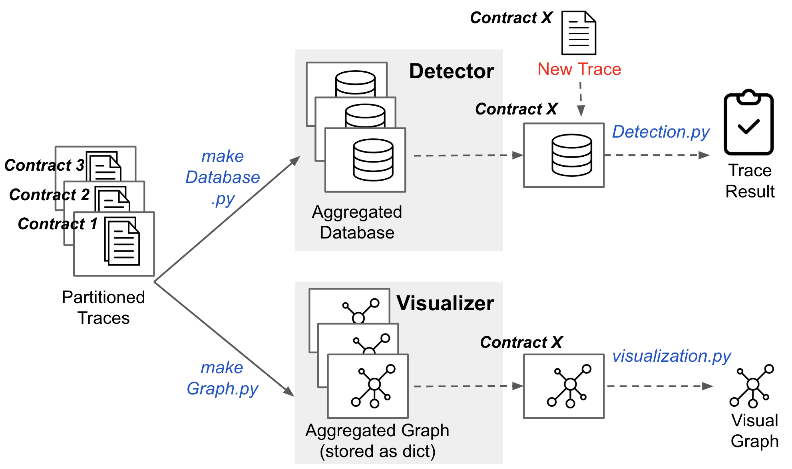

# Contract History Aggregator for EVM Project 
This repo is the final component of the Anomaly-based Detector for Northwestern University's EECS450 Final Project. 

## Code Execution


## Overview 
This repo contains two groups of scripts:

1. Table
This group aggregates all execution paths **and** related memory and storage dependencies that occurred for each contract into a **table** (implemented as a Python dictionary). This is the main database that will be used for detecting anomalies.
    * makeDatabase.py: Main script
    * HistoricalTable.py: Contains class for generating database with paths and dependencies.
    * TraceInfo.py: Contains helper class for extracting the execution path and dependencies for a given trace. 
    
2. Graph  
This group aggregates all the execution paths (**without** the memory and storage dependencies) that occurred for each contract into a **directed graph**. This is helpful for analyzing case studies.  
    * GraphAggregator.py: Contains class for aggregate list of paths into a single directed graph
    * preprocessing.py: To run before GraphAggregator.py for preprocessing input paths
    * visualization.py: To run after GraphAggregator.py for visualizing the graph

## Historical Table (HistoricalTable.py)
The historical table takes in the output from TraceInfo.py and updates its database.

### Format
Input: Output (list of dict) of TraceInfo.py (see below)

Output: A dict of dicts, where: <br>
* first level keys are the execution paths as tuples,
* second level keys are 'mrd' (memory-read-dependencies) or 'srd' (storage-read-dependencies)
* second level values are the respective reader-writer dependency tables (dicts) for 'mrd' and 'srd'.

### Example
Input: 
```
[{'mrd': {455: [4]}, 
  'path': '0, 11, 170, 340, 444, 11', 
  'srd': {}},
 {'mrd': {}, 
 'path': '0, 11, 558, 199', 
 'srd': {1296: [(1818, 'self')]}}]
```

Output: (Single Entry)
```
{'0, 11, 170, 340, 444, 11': {'mrd_possibilities': {455: [[4]]},
                              'srd_possibilities': {}},
 '0, 11, 558, 199': {'mrd_possibilities': {},
                     'srd_possibilities': {1296: [[(1818, 'self')]]}}}
```

## Trace Information Extraction (TraceInfo.py)
This is a helper script for extracting the exection path and dependencies for a given trace.

Given a trace, the script extracts the path, preprocesses it to no-loop paths, and assigns dependencies. 

### Format
Input: dict 

Output: list of dicts or None (if 'success' is False)

### Example
Input:
```
{'address': '0xcac7000c7dbaa2e33af15325af5d435e011c7bdd',
 'cti': [],
 'mrd': [{'reader': {'nonce': 66, 'op': 'MLOAD', 'pc': 455},
          'writers': [{'nonce': 3, 'op': 'MSTORE', 'pc': 4}]}],
 'path': [[1, 0],
          [8, 11],
          [18, 170],
          [39, 340],
          [60, 444],
          [111, 11],
          [112, 558],
          [117, 199]],
 'srd': [{'reader': {'cti': [], 'nonce': 122, 'pc': 1296},
          'writers': [{'cti': [], 'nonce': 115, 'pc': 1818}]}],
 'success': True}
```

Output: 
```
[{'mrd': {455: [4]}, 
  'path': '0, 11, 170, 340, 444, 11', 
  'srd': {}},
 {'mrd': {}, 
 'path': '0, 11, 558, 199', 
 'srd': {1296: [(1818, 'self')]}}]
```

## Graph Aggregator (GraphAggregator.py)
The graph aggregator takes in a list of execution paths (in terms of program counters) and outputs an aggregated directed graph. 

### Format
Input: A list of lists

Output: A dict of dicts of dict, where: <br>
* first level keys are source nodes, 
* second level keys are destination nodes,
* third level key is a fixed string ('constraint'),
* third level value is the subgraph of paths that the specific edge allows (a dict of dicts)<sup>1</sup>. <br>

<sup>1</sup>*Note: If a node does not exist as a key in the subgraph dict, all branches from that node are permitted paths. In addition, constraints are not added to non-branching edges since restrictions would be applied to earlier branching edges.*

### Examples
#### 1) Two inputs; multiple, non-consecutive branches; no loops
Input: 
```
[[1, 2, 4, 5, 7, 8], 
[1, 3, 4, 6, 7, 9]]
```


Output: 
```
{1: {2: {'constraint': {}}, 3: {'constraint': {}}},
 2: {4: {'constraint': {}}},
 3: {4: {'constraint': {}}},
 4: {5: {'constraint': {1: {2}}}, 6: {'constraint': {1: {3}}}},
 5: {7: {'constraint': {}}},
 6: {7: {'constraint': {}}},
 7: {8: {'constraint': {1: {2}, 4: {5}}}, 9: {'constraint': {1: {3}, 4: {6}}}}}
 ```
 


#### 2) Five inputs; multiple branches with consecutive branching (nodes 1,3,4); no loops
Input:
```
[[1, 2, 4, 5, 7, 8],
 [1, 3, 4, 6, 7, 9],
 [1, 3, 4, 5, 7, 8],
 [1, 3, 4, 10, 7, 9],
 [1, 3, 11, 4, 10]]
```


Output:
```
{1: {2: {'constraint': {}}, 3: {'constraint': {}}},
 2: {4: {'constraint': {}}},
 3: {4: {'constraint': {}}, 11: {'constraint': {1: {3}}}},
 4: {5: {'constraint': {1: {2, 3}, 3: {4}}},
     6: {'constraint': {1: {3}, 3: {4}}},
     10: {'constraint': {1: {3}, 3: {4}}}},
 5: {7: {'constraint': {}}},
 6: {7: {'constraint': {}}},
 7: {8: {'constraint': {1: {2, 3}, 4: {5}}},
     9: {'constraint': {1: {3}, 4: {10, 6}}}},
 10: {7: {'constraint': {}}},
 11: {4: {'constraint': {}}}}
```


## Preprocessing (preprocess.py)
The algorithm assumes that paths do not contain no-loops. In order to generalize the algorithm to paths with loops, users can run preprocessing script to first "flatten" their input paths. This turns paths with loops into the no-loop versions.

### Example
Input: 
```
[[1,2,3,4,2,3,4,5,7,8,5,6,8,9]]
```


Output:
```
[[1, 2, 3, 4, 2], 
[1, 2, 3, 4, 5, 7, 8, 5], 
[1, 2, 3, 4, 5, 6, 8, 9]]
```


## Graph Visualization (visualization.py)
The graph visualization takes the output generated by graph aggregator as the input, and creates a digraph using the Graphviz package in python.

### Example
Input
```
{1: {2: {'constraint': {}}, 3: {'constraint': {}}},
 2: {4: {'constraint': {}}},
 3: {4: {'constraint': {}}, 11: {'constraint': {1: {3}}}},
 4: {5: {'constraint': {1: {2, 3}, 3: {4}}},
     6: {'constraint': {1: {3}, 3: {4}}},
     10: {'constraint': {1: {3}, 3: {4}}}},
 5: {7: {'constraint': {}}},
 6: {7: {'constraint': {}}},
 7: {8: {'constraint': {1: {2, 3}, 4: {5}}},
     9: {'constraint': {1: {3}, 4: {10, 6}}}},
 10: {7: {'constraint': {}}},
 11: {4: {'constraint': {}}}}
```
Output: <br>

